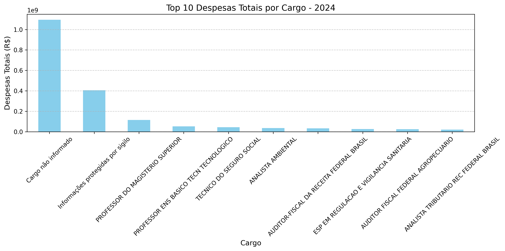
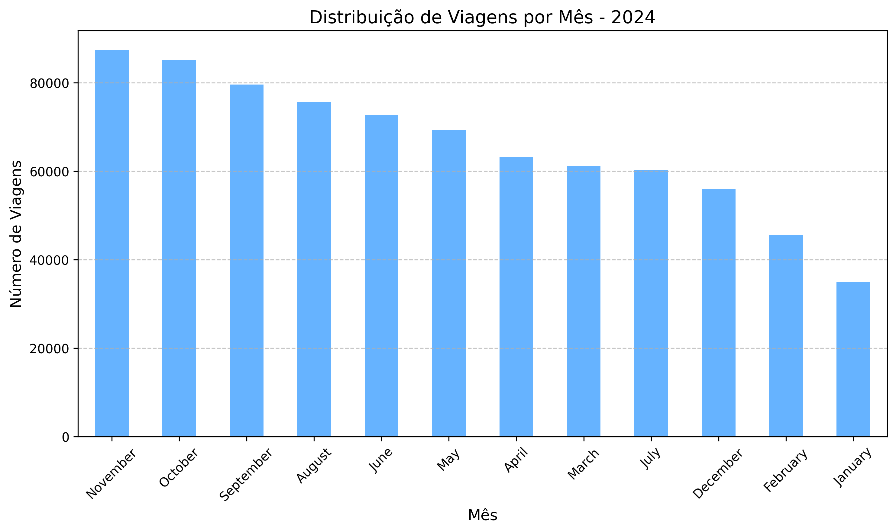
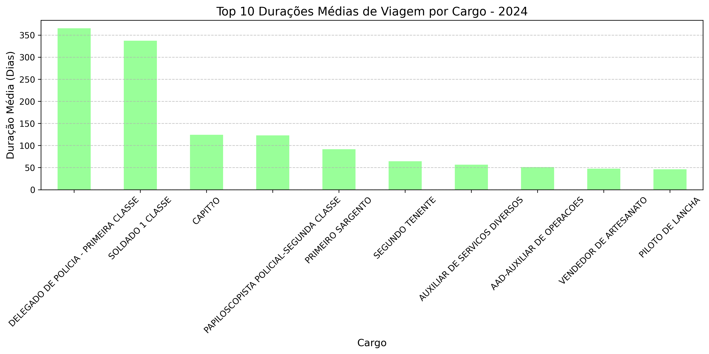
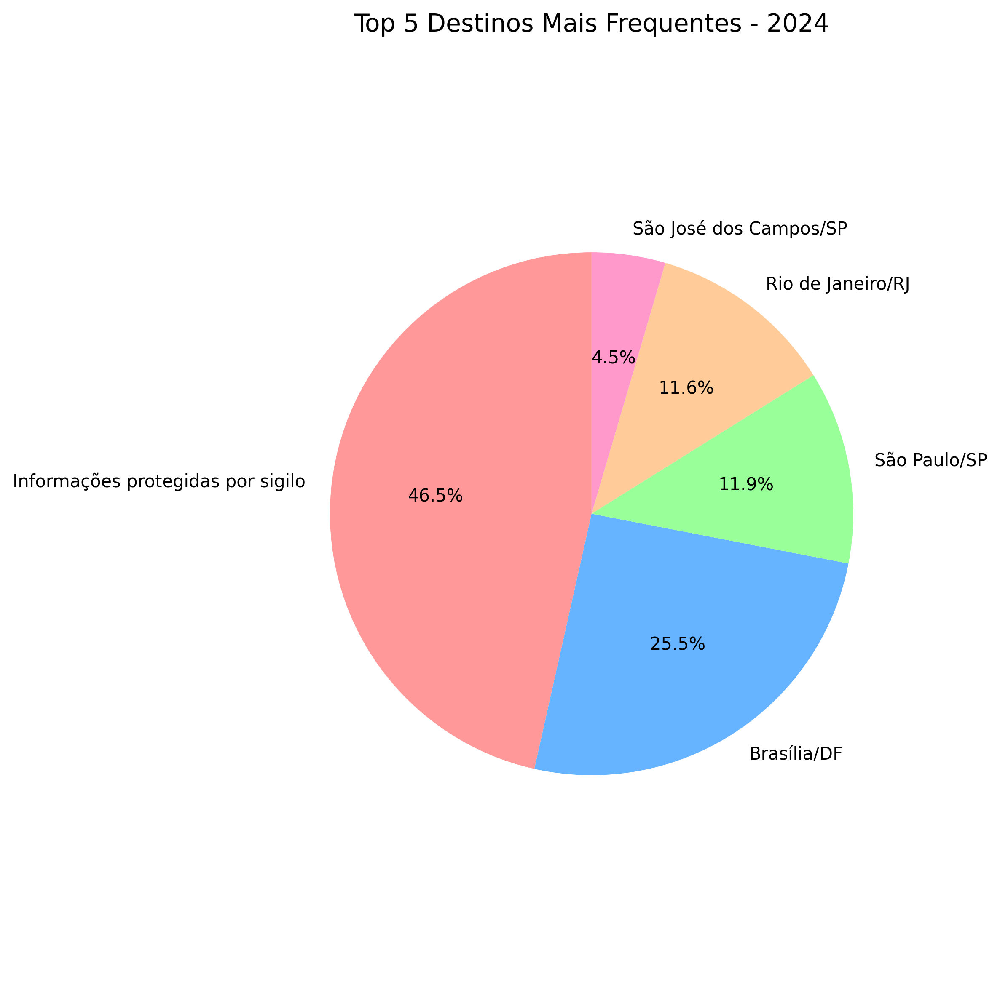
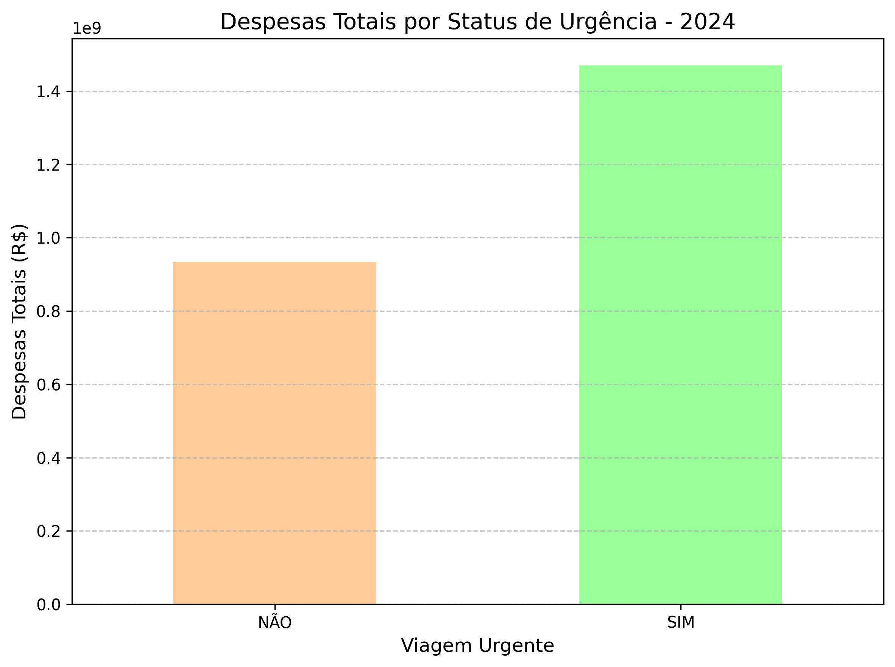
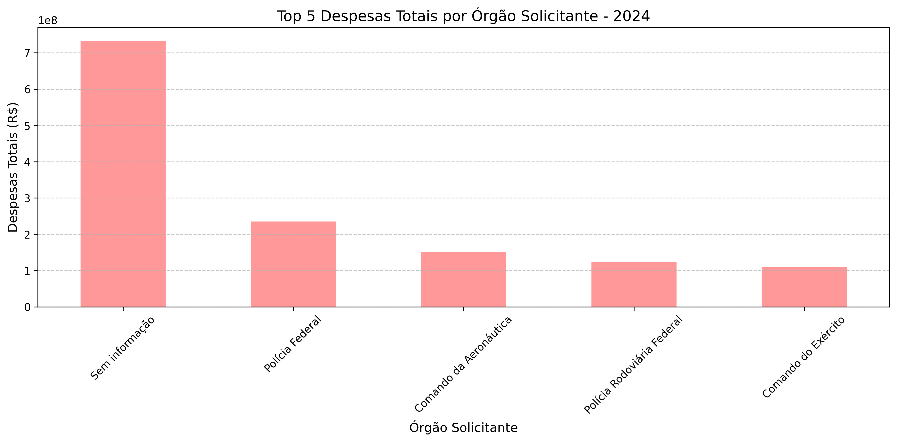
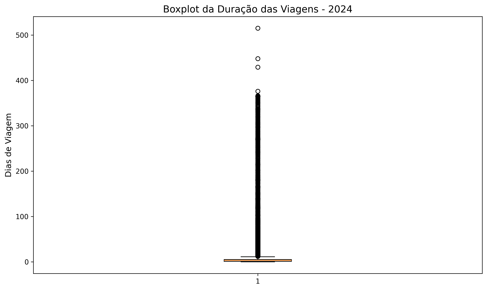

# Relatório de Análise de Viagens - Portal da Transparência 2024

## Introdução
Este relatório apresenta uma análise detalhada dos dados de viagens registradas no Portal da Transparência em 2024, com base no arquivo `2024_Viagem.csv`. O objetivo é explorar padrões de despesas, duração das viagens, destinos e impactos de fatores como urgência, utilizando técnicas de manipulação de dados com Python (Pandas) e visualização (Matplotlib). Os dados foram processados e visualizados em um notebook Jupyter, com os resultados sumarizados a seguir.

## Metodologia
- **Fonte de Dados:** Arquivo CSV contendo informações de processos de viagem, incluindo CPF do viajante, cargo, datas, destinos, valores de diárias, passagens e outros gastos.
- **Ferramentas:** Python com bibliotecas Pandas (para análise) e Matplotlib (para gráficos).
- **Processamento:** Criação de colunas como `Despesas` (soma de diárias, passagens e outros gastos) e `Dias de viagem` (diferença entre data de início e fim). Tratamento de valores nulos (ex.: "Cargo não informado").
- **Visualizações:** Gráficos de barras, pizza e boxplot para representar os dados.

## Análises e Resultados

### 1. Despesas Totais por Cargo
- **Objetivo:** Identificar quais cargos geram os maiores custos de viagem.
- **Resultado:** O cargo "Cargo não informado" lidera com despesas totais significativas, seguido por cargos como "AUDITOR-FISCAL DA RECEITA FEDERAL BRASIL". Isso pode indicar uma necessidade de maior detalhamento nos registros.
- **Visualização:**  

---

### 2. Distribuição de Viagens por Mês
- **Objetivo:** Verificar a sazonalidade das viagens ao longo do ano.
- **Resultado:** Há uma distribuição variada, com picos potenciais em meses como janeiro (devido a uma viagem de 365 dias) e maio. Isso sugere necessidade de investigar outliers.
- **Visualização:**  

---

### 3. Duração Média das Viagens
- **Objetivo:** Analisar a duração típica das viagens por cargo.
- **Resultado:** A duração média varia, com alguns cargos apresentando viagens longas (ex.: 365 dias em janeiro para "Cargo não informado"), possivelmente um erro de dados. A média geral exclui esses casos extremos.
- **Visualização:**  

---

### 4. Destinos Mais Frequentes
- **Objetivo:** Identificar os destinos mais comuns e seus custos associados.
- **Resultado:** Brasília/DF e Rio de Janeiro/RJ aparecem como destinos frequentes, refletindo atividades centralizadas. Destinos internacionais (ex.: Xangai/China) têm custos elevados de passagens.
- **Visualização:**  

---

### 5. Impacto de Viagens Urgentes
- **Objetivo:** Comparar despesas de viagens urgentes versus não urgentes.
- **Resultado:** Viagens marcadas como urgentes (ex.: linhas 9918 e 241056) tendem a ter custos mais altos, possivelmente devido a passagens ou diárias elevadas.
- **Visualização:**  

---

### 6. Custo por Órgão Solicitante
- **Objetivo:** Avaliar o impacto financeiro por órgão.
- **Resultado:** Órgãos como o Ministério da Agricultura e Pecuária e a Polícia Federal apresentam despesas significativas, indicando alta atividade de viagens.
- **Visualização:**  

---

### 7. Análise de Outliers
- **Objetivo:** Detectar e investigar anomalias nos dados.
- **Resultado:** Uma viagem de 365 dias (janeiro, linha 9918) é um outlier claro, possivelmente devido a um erro na data de fim (2024-12-31). Outros casos com durações longas devem ser revisados.
- **Visualização:**  

---

## Conclusões

### Principais Insights:
- A falta de informação em "Cargo" e "Órgão" sugere necessidade de melhoria na qualidade dos dados.
- Viagens longas e urgentes impactam significativamente os custos totais.
- Brasília/DF é o destino mais frequente, refletindo centralização administrativa.
